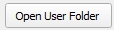

## LidarManager Qgis Plugin

Qgis Plugin to manage small and large LIDAR dataset. 
Useful to GIS user with intensive job in LIDAR analysis.

Requires LIDAR file(s) in readable directory and user with read and write privilege for QGIS user directory.
Utility tools for TIL and VRT are active only in Windows with OSGeo4w shell is present in default installation directory (point to system OSGEO4W_ROOT variable) and there isn't user limitation to cmd console.

Tested with QGIS 3.10 and later in Windows 8 and later.

https://github.com/lsulli/LidarManager/assets/11753702/2b4ce4fe-c20b-4c6f-83f0-2481cd10c159

## Summary
1. [Author](#autore)
2. [Main features](#fun_princ)
3. [Start](#start)
4. [Tile Index Layer Setting](#til_setting)
5. [Hillshading setting](#hlsd_setting)
6. [Add lidar to project](#add_lidar)
7. [Utility](#utility)

## Main features 

Add file(s) LIDAR and/or single virtual raster file directly from selected features in Tile Index Layer (**TIL**) with valid field path (you can create TIL with dedicate tool - see below). 
Set on the fly hillshading parameter and CRS. 
Change LIDAR hillshading setting in TOC.
Other Tools: 
  - copy LIDAR selected in TIL to destination directory
  - create Tile Index Layer from directory (with subdirectory) and populate valid field path (very fast: use OSGeo4W shell with gdaltileindex command)
  - create virtual raster file from LIDAR active in TOC
  - check path field in Tile Index Layer to control valid path for raster
  - interactive help string and log message

## AUTHOR 

Lorenzo Sulli - Autorità di bacino distrettuale Appennino settentrionale - Florence (Italy)

www.appenninosettentrionale.it

l.sulli@appenninosettentrionale.it - lorenzo.sulli@gmail.com

## START 

 When Lidar Manager Plugin is loaded you should see a button like this  in Plugins Toolbar and a submenu in Raster menu.
 The Lidar Manager window is always on the top also when Qgis is minimize, it's useful to work with other application like window explorer. 
 On start Lidar Manager window is put in the right bottom side of the screen.
 User can switch from Qgis main window to Lidar Manager window and work with both.
 
 **NB**: To prevent repeated requests for confirmation Project CRS on layer adding be sure to check "Leave as an unknown CRS (take non action)" in  setting/options/CRS Handling.
 
##  Tile Index Layer Setting 

Lidar Manager reads layers in Table of Content (TOC) and gets **only** polygon vector layer to populate "**Tile Index Layer LIDAR**" combo box list. Gets the first one in TOC. The list is empty if there aren't polygon layer. 

With dedicate button  User can get the active polygon layer in TOC.

Choose your the TIL with LIDAR reference if exist. User can create it with dedicate tool "**Create TIL from DIR**" in the **Utility** section.

In "**Field path file**" combo box are listing all the string type field present in the TIL, choose one with a file valid path.

With dedicate button  user can check path validity and report it in log box:

NB: check just a valid file path, not file type (raster, vector, text...)

You can set the EPSG code for CRS from a dedicate field ("**Field EPSG Code**" combo box) or from Qgis combo box for EPSG code list ("**Qgis Epsg code"**).

Whenever you load or open Lidar Manager by default it gets EPSG code from current Qgis project.

NB: EPSG setting is used by TIL and VRT tools. Remember it.

With "**lock as default**" checkbox user can lock input variable in "**Tile Index Setting"**  to preserve change. 

##  Hillshading Setting 
User can set hillshading variable Azimut, Elevation and Z factor before load Lidar or apply a new variable combination to vrt/group/file in TOC. 

NB: This is a LIDAR Manager, so Hillshading setting works on RGB image as a dtm: change styling from Qgis GUI if you load a rgb image.

With "**set default**" return to standard 315/45/1 value for azimut/elevation/z factor. 

##  Add Lidar to Project 
User can load LIDAR as single file or as Virtual Raster File (.vrt).

The code check file and try to loads it. Log box reports it.

Returns and load raster file

Returns no raster file and doesn't load it

VRT is created on Default User folder (code use QgsApplication::qgisSettingsDirPath that returns the path to the settings directory in user's home dir) with a name as **vrt_yyyy_mm_dd_hh_mm_ss.vrt**, set to EPSG code selected in combobox and loads on TOC. User can save vrt where he prefer.

NB: To create vrt file the code writes a batch file and run it on OSGeo4w shell. It's quite fast, faster than gdal python module, but with many files it could takes some time, be patient: thread process is not optimized. Log box reports it with a estimated process time:

##  Utility 
"**Copy LIDAR file to DIR**" reads file path on features selected in TIL and copy files to a destination folder. Thread process is not optimized so with many files Qgis application can turn to freeze: be patient.

"**Create TIL from DIR**" create a Tile Index Layer from a set of LiDAR files in a folder and write the file path in a field called "**location**", User can use this TIL file directly in LIDAR Manager. The code writes a batch file and run it on OSGeo4w shell. It's quite fast, faster than gdal python module, but with many files it could takes some time, be patient: thread process is not optimized. 

TIL is created as geopackage on Default User folder with a name as **TIL_yyyy_mm_dd_hh_mm_ss.gpkg*, set to EPSG code selected in combobox and loads on TOC. User can save TIL as he prefer.

"**Create vrt from TOC**" create a vrt file from a selected raster files in TOC. The code runs similar to "add LIDAR as vrt".

"**Clean log**" clean log box.

"**Active help string**" write in log box some information about tool than is activated by user. When user clik on  log box is like this:

"**Open User Folder**" open folder in 'processing/outputs/' subdirectory of directory setting in QgsApplication::qgisSettingsDirPath value.

"**Help**" open this markdown file in default OS web broswer

