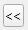

## LidarManager Qgis Plugin

Qgis Plugin to manage small and large LIDAR dataset. 
Useful to GIS user with intensive job in LIDAR analysis.

Requires LIDAR file(s) in readable directory and user with read and write privilege for QGIS user directory.
Utility tools for TIL and VRT are active only in Windows with OSGeo4w shell is present in default installation directory (point to system OSGEO4W_ROOT variable) and there isn't user limitation to cmd console.

Tested with QGIS 3.10 and later in Windows 8 and later.

## Summary
1. [Author](#autore)
2. [Main features](#fun_princ)
3. [Tile Index Layer Setting](#til_setting)
5. [Hillshading setting](#hlsd_setting)
6. [Utility](#utility)
7. [Caratteristiche Shapefile](#car_shape)
8. [Bug fix](#bug_fix)

## Main features 

Add file(s) LIDAR and/or single virtual raster file directly from selected features in Tile Index Layer with valid field path (you can create TIL with dedicate tool - see below). 
Set on the fly hillshading parameter and CRS. 
Change LIDAR hillshading setting in TOC.
Other Tools: 
  - copy LIDAR selected in Tile Index Layer to destination directory
  - create Tile Index Layer from directory (with subdirectory) and populate valid field path (very fast: use OSGeo4W shell with gdaltileindex command)
  - create virtual raster file from LIDAR active in TOC
  - check path field in Tile Index Layer to control valid path for raster
  - interactive help string and log message

## AUTHOR 

Lorenzo Sulli - Autorità di bacino distrettuale Appennino settentrionale - Florence (Italy)

www.appenninosettentrionale.it

l.sulli@appenninosettentrionale.it - lorenzo.sulli@gmail.com
 
##  Tile Index Layer Setting 

When Lidar Manager Plugin is load reads layers in Table of Content (TOC) and gets only polygon vector layer to populate combo box list. Gets the first one in TOC. The list is empty if there aren't polygon layer. 
With dedicate button  you can get the active polygon layer in TOC.

##  Hillshading Setting 

##  Utility 
